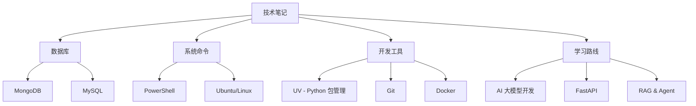

# 📚 技术笔记文档库

> 个人技术学习笔记整理，包含数据库、系统命令、Python 工具等常用技术文档

## 📑 文档导航

### 🗄️ 数据库相关
- **[MongoDB 安装与使用指南](./mongodb.md)**
  - WSL Ubuntu 环境安装配置
  - 基本 CRUD 操作
  - Python PyMongo 集成
  - 常见问题排查

- **[MySQL 安装与配置指南](./mysql.md)**
  - WSL Ubuntu 环境安装
  - 用户与权限管理
  - Python 数据库操作
  - SQLAlchemy ORM 使用
  - 性能优化技巧

### 💻 系统与命令行
- **[PowerShell 实用技巧](./powershell.md)**
  - 文件和目录管理
  - 环境变量配置
  - 网络操作
  - 进程管理
  - CMD/Linux 命令对照

- **[Ubuntu 常用命令指南](./unbuntu.md)**
  - 系统管理基础
  - 软件包管理 (APT)
  - 文件权限管理
  - 进程和服务管理
  - 实用技巧汇总

### 🐍 Python 工具
- **[UV 使用指南](./uv.md)**
  - 极速 Python 包管理器
  - 项目创建与初始化
  - 虚拟环境管理
  - 依赖管理最佳实践
  - 工具链集成

### 📖 学习计划
- **[AI 大模型应用开发学习计划](./笔记.md)**
  - 16 周完整学习路线
  - FastAPI + RAG + Agent 技术栈
  - 从后端到全栈的完整路径
  - 实战项目推荐

---

## 🎯 文档特点

✅ **结构清晰**：每个文档都有完整的目录导航  
✅ **示例丰富**：包含大量实际使用示例  
✅ **问题导向**：提供常见问题的解决方案  
✅ **持续更新**：定期补充和完善内容  

---

## 📊 技术栈覆盖



---

## 🚀 快速开始

### 数据库配置
如果你是新手，建议按以下顺序学习：

1. **安装 WSL Ubuntu** (Windows 用户)
2. **配置 MySQL** - [查看文档](./mysql.md)
3. **配置 MongoDB** - [查看文档](./mongodb.md)
4. **学习 Python 数据库操作**

### 命令行工具
1. **PowerShell 基础** - [查看文档](./powershell.md)
2. **Ubuntu/Linux 命令** - [查看文档](./unbuntu.md)
3. **掌握常用快捷键和技巧**

### Python 开发环境
1. **安装 UV** - [查看文档](./uv.md)
2. **创建项目和虚拟环境**
3. **管理依赖包**

---

## 📝 使用建议

### 对于初学者
- 从基础命令开始，循序渐进
- 每个命令都亲自动手试一试
- 遇到问题先查看"故障排查"章节

### 对于有经验的开发者
- 可以直接跳到"进阶使用"部分
- 重点关注"最佳实践"章节
- 将常用命令添加到个人 Profile

### 作为速查手册
- 每个文档都有完整的命令速查表
- 使用 Ctrl+F 快速搜索关键词
- 收藏常用的代码片段

---

## 🔄 更新日志

### 2025-10-16
- ✨ 完善 MongoDB 安装指南，新增 Python 集成示例
- ✨ 完善 MySQL 配置文档，添加 SQLAlchemy 使用说明
- ✨ 扩展 PowerShell 文档，增加网络和进程管理
- ✨ 完善 Ubuntu 命令指南，新增 651 行实用内容
- ✨ UV 文档已完整，包含所有核心功能
- 📝 创建主 README 导航文档

---

## 🤝 贡献与反馈

如果你发现文档中有错误或需要补充的内容，欢迎：
- 提出问题和建议
- 分享你的使用经验
- 补充更多实用技巧

---

## 📚 相关资源

### 官方文档
- [MongoDB 官方文档](https://www.mongodb.com/docs/)
- [MySQL 官方文档](https://dev.mysql.com/doc/)
- [PowerShell 文档](https://learn.microsoft.com/zh-cn/powershell/)
- [Ubuntu 文档](https://ubuntu.com/server/docs)
- [UV 官方文档](https://docs.astral.sh/uv/)

### 学习网站
- [菜鸟教程](https://www.runoob.com/)
- [Linux 命令大全](https://www.linuxcool.com/)
- [W3Schools](https://www.w3schools.com/)

### 社区
- [Stack Overflow](https://stackoverflow.com/)
- [GitHub](https://github.com/)
- [掘金](https://juejin.cn/)
- [CSDN](https://www.csdn.net/)

---

## 📌 文档使用技巧

### 在 VS Code 中阅读
1. 安装 "Markdown All in One" 插件
2. 按 `Ctrl+Shift+V` 预览 Markdown
3. 使用大纲视图快速导航

### 导出为 PDF
1. 在 VS Code 中安装 "Markdown PDF" 插件
2. 右键选择 "Markdown PDF: Export (pdf)"
3. 即可生成 PDF 文档

### 全文搜索
在文件夹中按 `Ctrl+Shift+F` 进行全局搜索，快速找到需要的命令或概念。

---

## ⭐ 收藏建议

将此文档库加入浏览器书签或 VS Code 工作区，方便随时查阅：

```bash
# 克隆到本地（如果是 Git 仓库）
git clone <repository-url>

# 或者直接在 VS Code 中打开此文件夹
code /path/to/技术笔记笔记
```

---

## 📧 联系方式

如有问题或建议，欢迎联系：
- 📧 Email: your.email@example.com
- 🐙 GitHub: [@yourusername](https://github.com/yourusername)

---

<div align="center">

**持续学习 · 不断进步 · 记录成长**

Made with ❤️ by [Your Name]

*最后更新: 2025-10-16*

</div>
